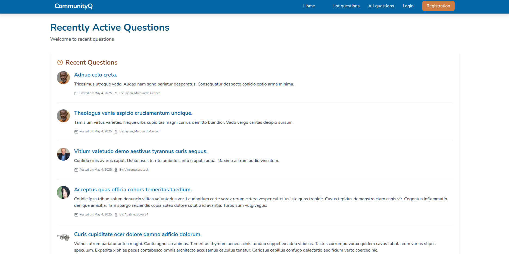

# Simple questions and answers forum

A simple forum web app, where users can share questions, answers and add comments.

## Features

- User authentication and authorization
- Posting questions and viewing question threads 
- Responding to questions with answers
- Ability to mark (accept) the most correct answer
- Commenting under answers
- Upvoting/downvoting answers and comments

## Tech stack

### Backend:
- Node.js 
- Express.js
- MongoDB paired with Mongoose
  
### Frontend:
- Handlebars
- Tailwind CSS 
- JavaScript

### Other:
- Multer
- Morgan 
- bcrypt


## Installation & Setup

### Prerequisites

- Node.js (v14+ recommended)
- npm or yarn
- MongoDB (local installation or MongoDB Atlas account)


Clone the repository:
```bash
git clone https://github.com/aptGetAdrian/questionForum.git
cd questionForum
```

Install dependencies:
```bash
npm install
```

Start the MongoDB service. You can configure the connection address in the `app.js` file:
```javascript
var mongoDB = "mongodb://127.0.0.1/questionsForum";
```

Run the app:
```bash
npm run dev
```

Access the app at `http://localhost:3000`

Bonus step: <br>
You can run the `seed.js` file to populate the database with random data. Before running the script, make sure 
to properly configure the connection address in the script.

## Screenshot

